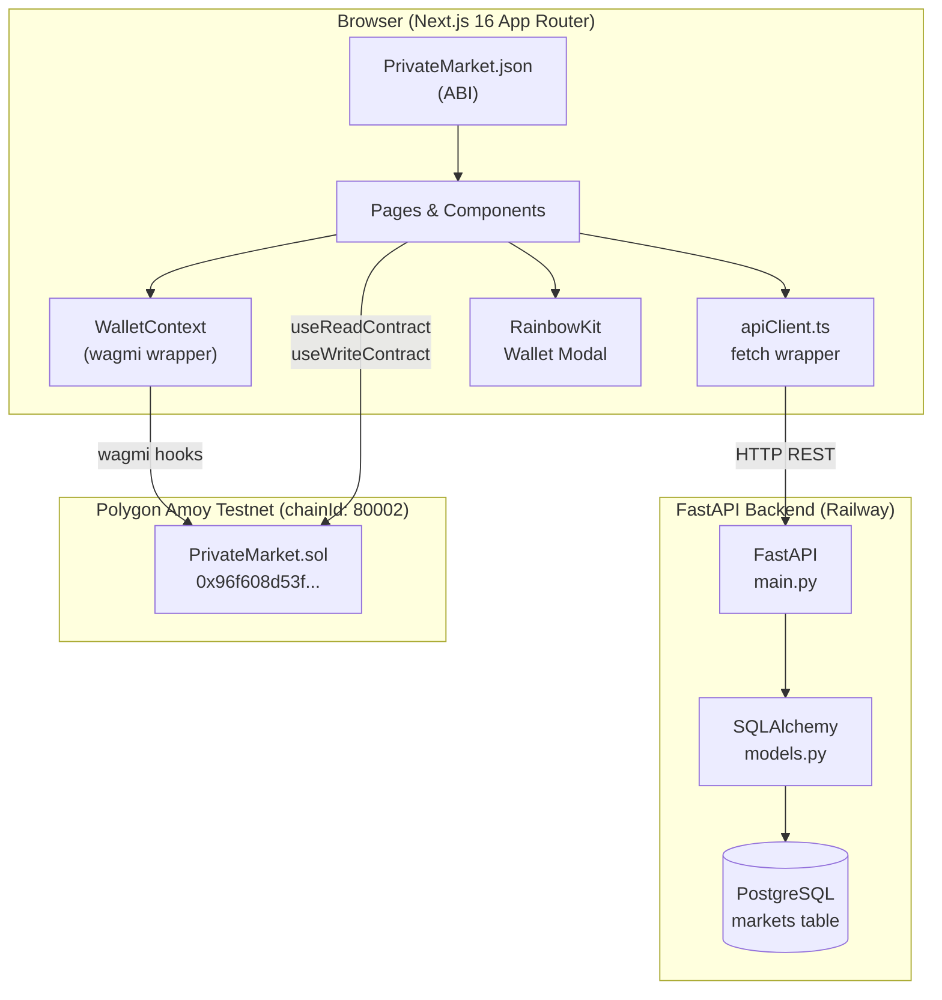
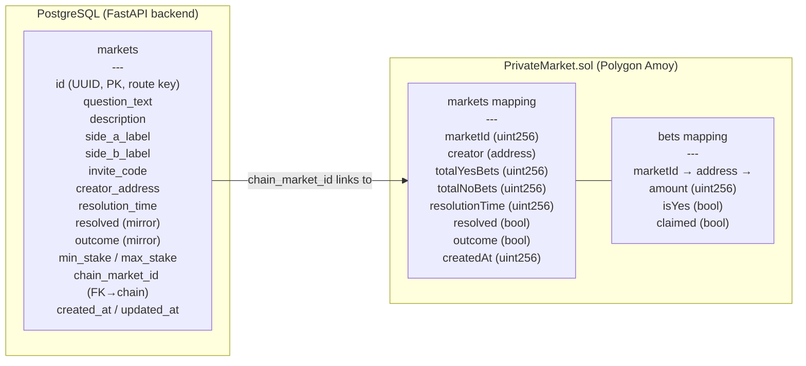
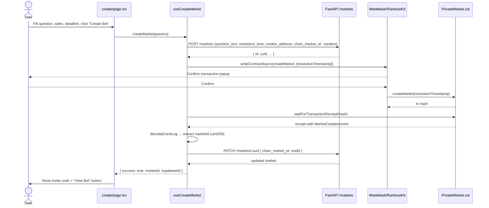
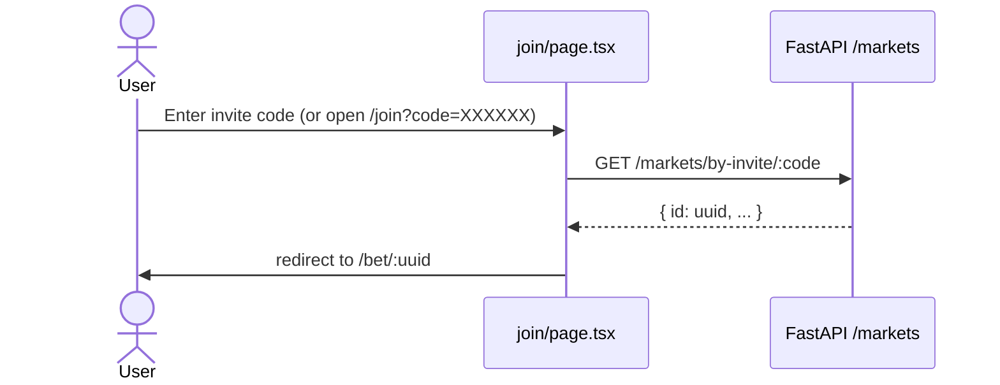
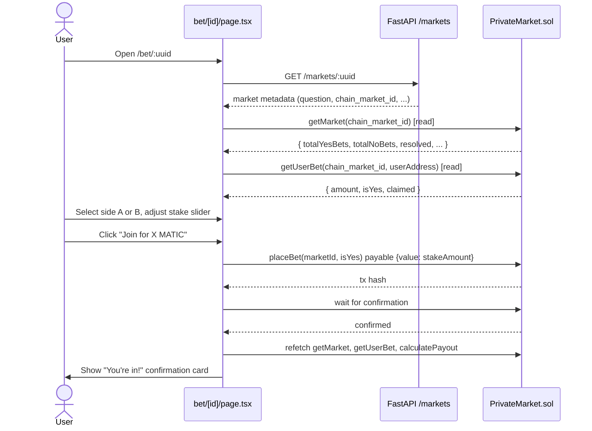
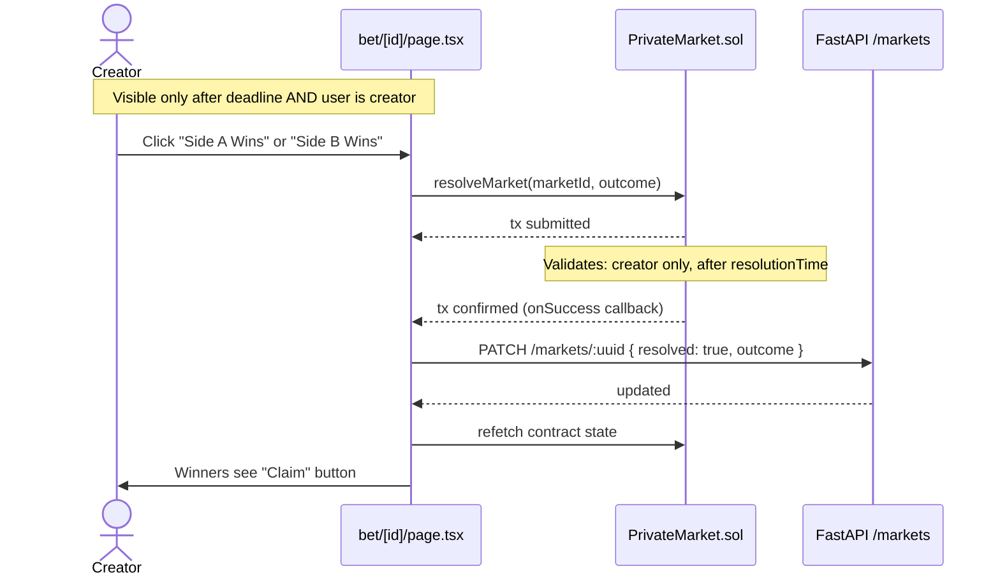
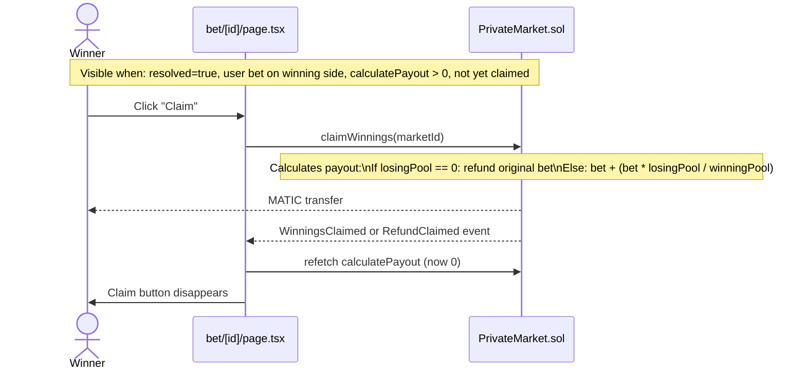

# ARCHITECTURE.md

## System architecture



---

## Data model — what lives where



**Privacy model**: The contract stores only numeric IDs and MATIC amounts. The question text, descriptions, side labels, and invite codes are private — accessible only through the API, not discoverable on-chain.

---

## Sequence: Create market



---

## Sequence: Join market



---

## Sequence: Place bet



---

## Sequence: Resolve market



---

## Sequence: Claim winnings



---

## Parimutuel payout formula

```
If losingPool == 0:
    payout = originalBet   ← full refund

Else:
    payout = originalBet + (originalBet × losingPool / winningPool)
           = originalBet × (winningPool + losingPool) / winningPool
           = originalBet × totalPot / winningPool
```

**Example** — YES wins, YES pool: 2 ETH (Alice 1 ETH, Bob 1 ETH), NO pool: 2 ETH:
- Alice payout: `1 + (1 × 2 / 2)` = 2 ETH
- Bob payout: `1 + (1 × 2 / 2)` = 2 ETH
- Carol (NO): 0 (cannot claim)
